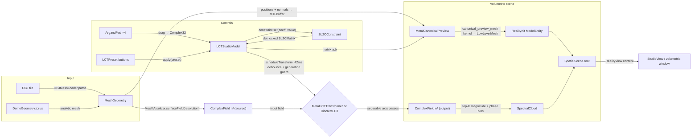

# Building the visionOS Spatial LCT Visualizer by Hand: A Developer's Guide

This is the long-form companion to the `codex/alok-781-lct-spatial` branch: a
reusable Swift/Metal package (`swift/LCTSpatial`) plus an Apple Vision Pro app
(`swift/LCTVision`) for interactively scrubbing an `SL(2,C)` linear canonical
transform and watching a 3D complex field respond in real time. Like the MLX
guide, it explains the surrounding system, every design decision, and enough
background that you could reimplement the whole change yourself without reading
the diff.

The branch is seven commits, and the commit boundaries are a good build order —
this guide walks them in roughly that order:

```
bcbfceb feat(swift): add dimension-agnostic SL2C transform core
21a4759 feat(metal): add separable complex field transform
3f92445 feat(vision): add Metal-backed canonical mesh preview
5682714 feat(vision): scaffold volumetric LCT field explorer
b4000a7 feat(vision): add scrub-first SL2C control deck
b7caea5 docs(swift): expose spatial package from repository root
75569fd fix(metal): support the b-zero LCT branch
```

## 1. Mathematical background: from SL(2,R) to SL(2,C), and onto a grid

### 1.1 The LCT as a unitary representation

The continuum linear canonical transform is a family of integral operators
indexed by a matrix

```
M = [ a  b ]
    [ c  d ]      with  ad − bc = 1,
```

acting on `L²(R)` as

```
(L_M f)(y) = 1/√(ib) ∫ exp( iπ (a x² − 2xy + d y²) / b ) f(x) dx    (b ≠ 0)
```

For real parameters this is (up to a sign ambiguity) a **unitary representation
of SL(2,R)** — more precisely of its double cover, the metaplectic group:
`L_{M₁} L_{M₂} = ± L_{M₁M₂}`. The subgroups you know by name:

- `(0, 1, −1, 0)` — the Fourier transform (up to a constant phase);
- `(cos θ, sin θ, −sin θ, cos θ)` — the fractional Fourier transform, the
  rotation orbit through the Fourier point;
- `(1, b, 0, 1)` — Fresnel free-space propagation (chirp convolution);
- `(1, 0, c, 1)` — a thin lens (chirp multiplication);
- `(a, 0, 0, 1/a)` — coordinate scaling.

On phase space the picture is simpler still: `L_M` conjugates position and
momentum operators linearly, `(q, p) ↦ (aq + bp, cq + dp)`. That phase-space
picture is exactly what the app's "canonical preview" mesh shows (section 8).

### 1.2 Why extend to SL(2,C) — and what you give up

Allowing complex `a, b, c, d` (still with `ad − bc = 1`) is genuinely
interesting: complex-ABCD matrices are the standard bookkeeping for Gaussian
beams through lossy or gain media in laser optics, `b = i`-type parameters give
Gauss–Weierstrass/Bargmann-flavored smoothing operators, and the analytic
continuation of the FrFT angle connects the Fourier orbit to heat flow.

What you give up is unitarity. With complex parameters the quadratic form in
the exponent acquires a nonzero *real* part, so the kernel magnitude
`|exp(·)| ≠ 1` pointwise: the operator can amplify, decay, or be outright
unbounded depending on where you sit in `SL(2,C)`. Determinant one alone does
not guarantee a bounded operator. The package says this out loud in
`swift/LCTSpatial/README.md:40-46` ("Mathematical boundary") and responds in
two ways rather than pretending the problem away:

1. every kernel evaluation clamps the real part of the complex exponent
   (section 10), so an interactive scrub can visit wild parameters without
   producing NaN/Inf geometry;
2. the singular `b = 0` branch **refuses** genuinely complex `d`
   (section 1.5), because there is no honest way to evaluate it on a real grid.

### 1.3 Separable multidimensional transforms

The general n-dimensional LCT is parameterized by `Sp(2n)` — a `2n × 2n`
block-symplectic matrix mixing all axes. This package deliberately restricts to
the **diagonal embedding `SL(2) ↪ Sp(2n)`**: one scalar 2×2 block, applied
independently along every axis of the field. That is the "isotropic" or
separable LCT:

```
L_M^(3D) = L_M ⊗ L_M ⊗ L_M
```

Two reasons for the restriction. First, UX: four complex numbers (really three
free ones, given the determinant lock) is a scrubbable control surface; a full
`Sp(6)` element is 21 real parameters and is not. Second, cost: a separable
transform of an `n³` field is three passes of `n`-point 1D transforms —
`O(rank · n^(rank+1))` — instead of an `n³ × n³` dense kernel. The rank-agnostic
implementation means the same code transforms a 1D test vector, a 2D image, or
the app's 3D voxel field.

### 1.4 The discretization tradeoff

Exactly as in the Python package (see the top of
`docs/guides/mlx-backend-dev-guide.md`): a finite-grid LCT cannot
simultaneously be unitary, compose like the underlying matrices, and sample the
continuum kernel. The Python side exposes the choice
(`normalization="unitary" | "compositional"`); the Swift side, whose job is
*visual intuition* rather than numerics-grade computation, picks one convention
and keeps it simple. The discrete kernel used everywhere
(`ComplexField.swift:127-137`, `LCTKernels.metal:62-73`) is the **centered,
sampled kernel with `1/√n` normalization**:

```
K(y, x) = (1/√n) · exp( iπ (a x² − 2xy + d y²) / (b·n) )
x, y ∈ {−(n−1)/2, …, +(n−1)/2}
```

Points worth internalizing:

- The grid is **centered**: index `i` maps to coordinate `i − (n−1)/2`
  (half-integers for even `n`). Centering makes the Fourier point the ordinary
  centered DFT and makes the FrFT orbit rotate about the field's middle rather
  than its corner.
- At the Fourier preset `(a,b,c,d) = (0,1,−1,0)` the phase collapses to
  `−2πi·xy/n` and the prefactor is `1/√n`: a unitary centered DFT, which is why
  the impulse test in section 11 expects flat magnitude `1/√n`.
- There is **no `1/√(ib)` prefactor**. The continuum amplitude factor is a
  global complex constant per matrix; for a display tool it only rescales and
  rotates every voxel's color identically, so the implementation uses the real
  `1/√n` and stays exactly unitary at the Fourier point instead. If you extend
  this library toward numerics, this is the first convention to revisit.
- Complexity is honest brute force: each output sample sums over `n` inputs, no
  FFT factorization, no Bluestein. At the app's default `14³` field that is
  `3 × 14⁴ ≈ 115k` kernel evaluations per transform — trivial for a GPU and
  fine even for the CPU reference. This is a *deliberate* difference from the
  Python/MLX backends, which are `O(N log N)` because they run inside training
  loops. Here, clarity and rank-agnosticism win.

### 1.5 The `b = 0` singular branch, and the refusal of complex `d`

At `b = 0` the integral kernel degenerates (the `1/b` blows up) and the
continuum operator becomes a chirp-multiplied coordinate scaling:
`(L f)(y) = √d · exp(iπ c d y²) · f(d y)` with `d = 1/a`. The finite-grid
version used here (doc comments at `ComplexField.swift:144-145` and
`LCTKernels.metal:76-77`) is

```
(L f)(y) = √d · exp( iπ c d y² / n ) · f(d·y)
```

on the same centered grid, with the `/n` phase scaling chosen to match the
`b ≠ 0` kernel's `/(b·n)` convention, and `f(d·y)` evaluated by **linear
interpolation** between the two nearest grid samples, zero outside the grid
(`ComplexField.swift:165-178`, `LCTKernels.metal:94-109`). This mirrors the
Python implementation's `grid_sample(padding_mode="zeros", align_corners=True)`
branch — the closed form `p = Re(d)·(k − (n−1)/2) + (n−1)/2` is literally
`ComplexField.swift:166-167` (`sourceCoordinate = matrix.d.real * y + center`).

Now the refusal. Both the CPU path (`ComplexField.swift:76-79`) and the Metal
path (`MetalLCTTransformer.swift:57-60`) do:

```swift
if matrix.b.magnitude <= 1e-6 {
  guard abs(matrix.d.imaginary) <= 1e-5 else {
    throw DiscreteLCTError.complexScalingUnsupported
  }
```

Why refuse rather than "do something"? Because `f(d·y)` with complex `d` asks
for the field's value at a **complex coordinate**. On the continuum that is an
analytic continuation — you would need to pick a contour and assume the signal
extends holomorphically off the real axis. On a finite grid of samples there is
no canonical continuation at all: any formula you write (interpolate the real
part of the coordinate and multiply by some fudge, resum against a Gaussian,
etc.) is inventing data the samples do not contain. The README states the
policy (`swift/LCTSpatial/README.md:36-38`): unsupported is reported "rather
than silently inventing a contour deformation." Note the asymmetry: complex `c`
is *fine* in this branch — it only appears inside the chirp `exp(iπ c d y²/n)`,
where a complex value just means gain/decay, handled by the exponent clamp. The
Metal parity test in section 11 deliberately uses `c = −0.28 + 0.05i` to pin
that down.

Also note the branch ordering: the identity matrix has `b = 0`, but both
implementations check `matrix == .identity` *first*
(`ComplexField.swift:74`, `MetalLCTTransformer.swift:56`) and return the field
untouched — the same fast-path lesson the NanoGPT benchmarking taught on the
Python side.

## 2. Architecture map

The change is one package with two products plus one app target:

```
Package.swift                      # root manifest — repo is itself a Swift package
swift/LCTSpatial/
  Package.swift                    # nested manifest for focused development
  Sources/LCTSpatial/              # product 1: pure Swift core, no Metal, no UI
    Complex32.swift
    ComplexField.swift             # ComplexField + DiscreteLCT (CPU reference)
    SL2CMatrix.swift               # SL2CMatrix + SL2CConstraint + CanonicalPairTransform
    MeshGeometry.swift             # MeshGeometry + OBJMeshLoader + MeshVoxelizer
    PhaseColor.swift
  Sources/LCTSpatialMetal/         # product 2: GPU implementations
    MetalLCTTransformer.swift      # true sampled-field transform
    MetalCanonicalPreview.swift    # LowLevelMesh canonical preview
    Shaders/LCTKernels.metal       # all three kernels
  Tests/LCTSpatialTests/           # 8 CPU tests
  Tests/LCTSpatialMetalTests/      # 2 CPU-vs-GPU parity tests
swift/LCTVision/                   # visionOS app (XcodeGen project)
  project.yml
  LCTVision/
    LCTVisionApp.swift  StudioView.swift  SpatialScene.swift
    LCTStudioModel.swift  ControlDeck.swift  ArgandPad.swift
    SpectralCloud.swift  LCTPreset.swift  DemoGeometry.swift  Info.plist
```

Wiring diagram — boxes are state-carrying objects, labeled edges are the maps
between them:



The load-bearing architectural fact, stated in
`swift/LCTSpatial/README.md:6-12` and enforced by the module split: there are
**two different operations that must never be conflated** —

- `DiscreteLCT` / `MetalLCTTransformer` transform a *sampled complex field*.
  This is the actual Atlas-style signal transform.
- `CanonicalPairTransform` / `MetalCanonicalPreview` apply the raw 2×2 matrix
  to *paired vectors* (`q′ = aq + bp`). It is a zero-latency phase-space
  preview, not the integral transform of anything.

Section 9 returns to why both exist and why they are kept apart.

## 3. `Complex32` — the interop-stable scalar

`swift/LCTSpatial/Sources/LCTSpatial/Complex32.swift`

The obvious question first: why not `swift-numerics`' `Complex<Float>`? Three
reasons, all about the Metal boundary:

1. **Layout guarantee.** `Complex32` is `@frozen` with exactly two `Float`
   stored properties (`Complex32.swift:4-7`), so its stride is 8 bytes and
   bit-identical to Metal's `float2`. `MetalLCTTransformer.transform` asserts
   this at runtime — `precondition(MemoryLayout<Complex32>.stride ==
   MemoryLayout<SIMD2<Float>>.stride)` (`MetalLCTTransformer.swift:61`) — and
   then blits `[Complex32]` arrays straight into `MTLBuffer`s with no
   conversion pass.
2. **Zero dependencies.** The package has no external requirements, which keeps
   the root-manifest trick in section 12 friction-free.
3. **Control over the numerics that matter here** — two members deserve
   attention:

```swift
// Complex32.swift:41-47 — principal square root via half-angle identities
public var squareRoot: Self {
  let radius = magnitude
  let realPart = sqrt(max((radius + real) / 2, 0))
  let imaginaryMagnitude = sqrt(max((radius - real) / 2, 0))
  let imaginaryPart = imaginary < 0 ? -imaginaryMagnitude : imaginaryMagnitude
  return .init(real: realPart, imaginary: imaginaryPart)
}
```

This is `√((|z|+Re z)/2) + i·sign(Im z)·√((|z|−Re z)/2)` — the principal branch
(cut along the negative real axis), computed without any `atan2`/half-angle
trig, and the `max(·, 0)` guards absorb float cancellation when `|z| ≈ |Re z|`.
It is used for the `√d` amplitude in the singular branch, and it is transcribed
*verbatim* into Metal as `complex_sqrt` (`LCTKernels.metal:28-34`) so CPU and
GPU pick the same branch for every `d`.

```swift
// Complex32.swift:49-57 — the safety valve for SL(2,C)
public func exponential(maximumReal: Float = 20) -> Self {
  let boundedReal = min(max(real, -maximumReal), maximumReal)
  let scale = exp(boundedReal)
  return .init(real: scale * cos(imaginary), imaginary: scale * sin(imaginary))
}
```

`exponential` clamps only the **real** part of the exponent — the phase is
never touched, so the hue channel of the visualization stays exact; only the
magnitude saturates. This single function is what makes scrubbing arbitrary
complex parameters safe (section 10).

The rest of the file is the operator zoo (`+ − * /`, scalar variants, `+=`,
unary minus, `Complex32.swift:67-117`), all `@inlinable` so the hot CPU loops
don't pay call overhead, plus `zero/one/i`, `magnitude(Squared)`, `phase`
(`atan2`), `conjugate`, and a `description` used directly by the app's
determinant readout.

## 4. `ComplexField` and `DiscreteLCT` — the rank-agnostic CPU reference

`swift/LCTSpatial/Sources/LCTSpatial/ComplexField.swift`

### 4.1 The container

`ComplexField` (`ComplexField.swift:12-55`) is a validated row-major
`shape: [Int]` + `values: [Complex32]` pair. The initializer rejects empty
shapes, non-positive dimensions, and count mismatches with typed errors
(`ComplexFieldError`, lines 3-9) — errors as data, not preconditions, because
field shapes come from user actions (resolution menu, imported meshes).
Convenience members: `rank`, `count`, `maxMagnitude`, a bounds-checked
`flatIndex(_:)` in the usual row-major recurrence
(`result = result * shape[axis] + index`, lines 37-49), and
`normalizedMagnitudes(gamma:)` for display scaling.

### 4.2 The separable driver

`DiscreteLCT.transform` (`ComplexField.swift:68-104`) is the CPU reference —
the doc comment (lines 63-67) is explicit that it is "intentionally
O(rank × n^(rank+1))" and exists for "tests, tiny fields, and the fallback
path; `LCTSpatialMetal` owns live grids." Its structure is the dispatch you
must reproduce on the GPU:

1. `matrix == .identity` → return the field untouched (line 74);
2. `matrix.b.magnitude <= 1e-6` → the singular branch, after refusing complex
   `d` (lines 76-91);
3. otherwise → the generic kernel (lines 93-103).

Both branches loop `for axis in field.shape.indices` and re-feed the output of
one axis pass as the input of the next — this loop *is* the tensor-product
factorization `L ⊗ L ⊗ L`.

### 4.3 Strided axis addressing — the one idiom to burn in

Both `transformAxis` and the Metal kernels address "the 1D line through element
`e` along `axis`" the same way. For row-major `shape`:

```swift
// ComplexField.swift:113-115
let length = shape[axis]
let stride = shape.dropFirst(axis + 1).reduce(1, *)  // product of trailing dims
let block  = length * stride
```

Elements of one line are `blockStart + k * stride + inner` for
`k in 0..<length`, where `blockStart` walks blocks of size `block` (outer
dimensions) and `inner in 0..<stride` walks the trailing dimensions. Three
nested loops (`outer`, `inner`, `outputIndex`) then enumerate every output
sample of every line (`ComplexField.swift:121-140`). Getting this arithmetic
identical between Swift and Metal is what makes the parity tests in section 11
a pure numerics comparison rather than an indexing hunt.

### 4.4 The generic kernel, in code

```swift
// ComplexField.swift:124-137 (inner loops)
let y = Float(outputIndex) - Float(length - 1) / 2
var sum = Complex32.zero
for inputIndex in 0..<length {
  let x = Float(inputIndex) - Float(length - 1) / 2
  let numerator =
    matrix.a * (x * x)
    - Complex32(real: 2 * x * y)
    + matrix.d * (y * y)
  let phase = piI * (numerator / (matrix.b * Float(length)))
  let kernel = phase.exponential(maximumReal: maximumKernelExponent)
  sum += input[blockStart + inputIndex * stride + inner] * kernel
}
output[blockStart + outputIndex * stride + inner] = sum * normalization
```

with `piI = Complex32(real: 0, imaginary: .pi)` and
`normalization = 1/√length`. This is the section 1.4 formula, character for
character. Note that `a`, `b`, `d` enter as full complex values — nothing is
special-cased for the real subgroup.

### 4.5 The singular branch, in code

`transformSingularAxis` (`ComplexField.swift:146-183`) implements
`√d · exp(iπ c d y²/n) · f(dy)`:

```swift
// ComplexField.swift:166-178
let sourceCoordinate = matrix.d.real * y + center
guard sourceCoordinate >= 0, sourceCoordinate <= Float(length - 1) else { continue }
let lower = Int(floor(sourceCoordinate))
let upper = min(lower + 1, length - 1)
let fraction = sourceCoordinate - Float(lower)
let sample = lowerValue * (1 - fraction) + upperValue * fraction
let phase = piI * (matrix.c * matrix.d) * (y * y / Float(length))
let chirp = phase.exponential(maximumReal: maximumKernelExponent)
output[...] = amplitude * chirp * sample
```

where `amplitude = matrix.d.squareRoot` (line 159; complex, but `d` is
near-real by the guard) and out-of-grid samples stay zero via the `continue`
against a zero-initialized output — the "padding_mode=zeros" analog. Only
`d.real` steers the resampling; `c` may be complex and only feeds the chirp.

## 5. `SL2CMatrix` and `SL2CConstraint` — the determinant lock

`swift/LCTSpatial/Sources/LCTSpatial/SL2CMatrix.swift`

### 5.1 The matrix type

`SL2CMatrix` (lines 8-64) is four `Complex32` fields with named constructors
(`identity`, `fourier = (0, 1, −1, 0)`, `fractionalFourier(angle:)`,
`fresnel(distance:)` — note `distance` is *complex*, which is how the app's
"Complex lens" preset works), a `determinant`, an
`isUnimodular(tolerance: 1e-4)` predicate, and — the piece that makes generic
UI possible — a subscript over the `SL2CCoefficient` enum (`case a, b, c, d`,
lines 3-5) so the four Argand pads can be one view driven by a `ForEach`.

### 5.2 The design problem the constraint solves

`ad − bc = 1` is one complex equation on four complex unknowns. During a scrub
the user freely drags *one* coefficient; something else must move to stay on
the group. The obvious answer — "always solve for `d = (1+bc)/a`" — breaks the
moment `a` gets small: the solved `d` shoots off to infinity and the UI
explodes. And the Fourier matrix itself has `a = 0`, so the obvious answer
breaks *at the most important preset*.

`SL2CConstraint` (lines 74-150) answers with a **preferred-pivot-with-fallback**
scheme. State: the current `matrix`, the current `dependent` coefficient
(exposed to the UI as the orange `AUTO` chip), a `lockDeterminant` flag, and
`pivotEpsilon = 1e-4`. The core method:

```swift
// SL2CMatrix.swift:92-109
public mutating func set(_ coefficient: SL2CCoefficient, to value: Complex32) throws -> SL2CMatrix {
  matrix[coefficient] = value
  guard lockDeterminant else { return matrix }
  let preferred = coefficient == dependent ? nil : dependent
  let selected =
    try preferred.flatMap { candidate in
      pivotMagnitude(for: candidate, in: matrix) >= pivotEpsilon ? candidate : nil
    } ?? bestPivot(excluding: coefficient)
  matrix[selected] = solvedValue(for: selected, in: matrix)
  dependent = selected
  return matrix
}
```

Read it carefully — every clause is a UX decision:

- **Write first, solve second.** The user's edit always lands verbatim; the
  constraint never fights the finger.
- **Sticky dependent.** If the current dependent's solve is well-conditioned,
  keep it — the AUTO chip should not jump around while you scrub.
- **Scrubbing the AUTO pad is allowed.** If you edit the dependent coefficient
  itself, `preferred` becomes `nil` (line 100) and a new dependent is chosen
  from the other three — every pad stays live.
- **Conditioning is denominator magnitude.** `pivotMagnitude` (lines 129-136)
  maps each candidate to the magnitude of the denominator its solve would
  divide by: solving `d = (1+bc)/a` divides by `a`, `a = (1+bc)/d` by `d`,
  `c = (ad−1)/b` by `b`, `b = (ad−1)/c` by `c` (`solvedValue`, lines 138-149).
- **Auto-pivot.** `bestPivot` (lines 116-127) filters candidates ≠ the edited
  coefficient with denominator ≥ `pivotEpsilon` and takes the
  largest-magnitude one; if *no* entry is stable — the matrix has been dragged
  somewhere every solve is singular — it throws `noStablePivot`, which the app
  surfaces as a status message ("No stable unimodular pivot",
  `LCTStudioModel.swift:54`) instead of corrupting the matrix.

`replace(with:dependent:)` (lines 111-114) is the preset path: it swaps the
whole matrix in without solving, since presets are exact group elements by
construction.

### 5.3 `CanonicalPairTransform`

The last twenty lines of the file (152-168) are the "dimension-agnostic" phase
space map from the first commit's title: given equal-length `q` and `p` arrays
of any dimensionality, return `(aq + bp, cq + dp)` elementwise. The unit test
uses it at the Fourier point to check `(q, p) ↦ (p, −q)`. Its real purpose is
to be the *specification* the Metal preview kernel implements per vertex
(section 8).

## 6. Mesh ingestion: `MeshGeometry`, OBJ, voxelization

`swift/LCTSpatial/Sources/LCTSpatial/MeshGeometry.swift`

### 6.1 `MeshGeometry`

A validated triangle soup (lines 10-71): `positions`, `normals`, `indices`,
with the initializer rejecting empty vertex sets, non-multiple-of-3 index
counts, and out-of-range indices. Two behaviors to know:

- **Normals are optional in, guaranteed out.** If the caller's `normals` count
  doesn't match `positions`, area-weighted smooth normals are generated
  (lines 52-70): accumulate the *unnormalized* face cross product onto each
  corner — the cross product's length is twice the triangle area, so big
  triangles dominate for free — then normalize, with a `(0,1,0)` fallback for
  degenerate vertices. This matters because the preview uses the normal field
  as the momentum `p`; imported OBJs (whose `vn` lines are ignored — see below)
  still get a smooth `p`.
- **`normalized(extent: 1.7)`** (lines 35-50) recenters to the AABB midpoint
  and scales the longest axis to a target extent, so any import lands at a
  sensible size in the study volume, with a guard against zero-extent
  degenerate meshes.

### 6.2 `OBJMeshLoader` — deliberately minimal

Lines 80-120: a dependency-free Wavefront parser that handles exactly two
commands. `v` lines become positions (malformed → error with a 1-based line
number). `f` lines: each corner token is split on `/` and only the leading
position index is kept — **`vt`/`vn` references are dropped**, normals being
regenerated as above; **negative (relative) indices** are resolved OBJ-style as
`positions.count + rawIndex` (line 102); and polygons with more than three
corners are **fan-triangulated** from the first vertex
(lines 108-110). No faces at all → `noFaces`. Everything else (`o`, `g`,
`usemtl`, `s`, comments) falls through the `guard let command` and is ignored.
The README is explicit that OBJ is "only the sample app's current
document-picker format" (`swift/LCTVision/README.md:31-32`) — the library API
boundary is `MeshGeometry`, so a USDZ importer is an app-side extension, not a
library change (section 13).

### 6.3 `MeshVoxelizer` — from surface to field

The bridge between "a mesh" and "a thing an LCT can transform"
(lines 122-162). `surfaceField(from:resolution:)`:

1. normalize the mesh into `[-0.85, 0.85]³` (via `normalized()`);
2. for each triangle, choose a sampling density from its longest edge —
   `steps = max(2, min(64, ceil(longest · resolution)))` (lines 147-148) — so
   sample spacing tracks voxel size regardless of tessellation;
3. walk barycentric coordinates `(u, v) = (i/steps, j/steps)` with
   `j ≤ steps − i` (the triangle half of the square, lines 149-154) and
   **splat** each surface point into the nearest voxel (`round`, not
   trilinear — lines 132-141) of a `resolution³` density accumulator;
4. normalize by the max count and emit a **purely real** `ComplexField`
   (`Complex32(real: min(density/max, 1))`, line 159) of shape
   `[resolution, resolution, resolution]`.

The result: voxels containing surface get density ≈ their local surface area,
empty space is exactly zero, and the initial phase is zero everywhere — so all
phase structure you subsequently see in the cloud is *created by the
transform*, which is exactly the pedagogical point.

## 7. Phase coloring — the Atlas convention

`swift/LCTSpatial/Sources/LCTSpatial/PhaseColor.swift`

The package standardizes on the *Atlas of Fourier Transforms* /
domain-coloring convention: **hue encodes phase, luminance encodes
magnitude**. The CPU-side implementation:

```swift
// PhaseColor.swift:12-16
let magnitude = pow(min(value.magnitude / max(maximumMagnitude, .leastNonzeroMagnitude), 1), gamma)
let hue = (value.phase + .pi) / (2 * .pi)
let rgb = hsvToRGB(hue: hue, saturation: 0.82, value: 0.18 + 0.82 * magnitude)
return SIMD4<Float>(rgb.x, rgb.y, rgb.z, alpha * magnitude)
```

Decisions encoded here: phase `−π…π` maps affinely onto one trip around the
hue circle (so phase is periodic with no seam); magnitude is normalized against
the field max and gamma-compressed with `gamma = 0.55` to lift faint structure
(a straight linear map makes everything but the peak invisible); value has a
`0.18` floor so even near-zero samples read as dark color rather than black;
alpha *also* scales with magnitude so weak samples fade out. `hsvToRGB` (lines
19-34) is the standard six-sector conversion, written out to avoid importing
UIKit into the core target.

The same convention appears twice more, adapted to context: the Metal preview
kernel's `phase_rgb` (`LCTKernels.metal:130-135`) computes the hue wheel with
the branchless `fract`/`abs` idiom and mixes toward a `0.18`-luminance floor
with weight `0.86`; and `SpectralCloud` bakes the wheel into 18 quantized
materials (section 9.2). One convention, three renderers — when you see cyan
mean "phase ≈ +π/2" in one view, it means the same in the others.

## 8. The Metal layer

### 8.1 `MetalLCTTransformer` — the true transform on GPU

`swift/LCTSpatial/Sources/LCTSpatialMetal/MetalLCTTransformer.swift` and the
first two kernels of `Shaders/LCTKernels.metal`.

The class holds a device, a queue, and **two pipelines** — `lct_axis_pass` and
`lct_singular_axis_pass` — compiled once at init (lines 33-49). The header
`@_exported import LCTSpatial` (line 2) means app code importing
`LCTSpatialMetal` sees the core types without a second import.

`transform(_:matrix:maximumKernelExponent:)` (lines 51-136), step by step:

1. **Dispatch decision on the CPU, once per call** (lines 56-60): identity →
   early return; `b.magnitude <= 1e-6` → singular pipeline, with complex `d`
   refused as `MetalLCTError.complexScalingUnsupported`. The GPU kernels
   contain no branch selection — same philosophy as the MLX "plan" pattern:
   decide on concrete values host-side, keep device code straight-line.
2. **Two shared-storage buffers** (lines 63-76): the input array is copied into
   buffer A, buffer B starts empty. `.storageModeShared` is the right choice on
   Apple-silicon unified memory — no blit encoders, and the final readback is
   a pointer bind. This is also where the `Complex32`/`float2` stride
   precondition lives (line 61).
3. **One encoder per axis, ping-ponging** (lines 86-124): for each axis,
   compute `length`, `elementStride`, `block` exactly as the CPU does, pack
   them with the total count into a `SIMD4<UInt32> dimensions`, bind the
   matrix coefficients as `float2` via `setBytes` (small constants — no buffer
   management), dispatch, then `swap(&input, &output)`. All axis passes are
   encoded into a **single command buffer**, so the GPU runs the three axes
   back to back with no CPU round-trips; ordering between encoders within one
   command buffer is guaranteed by Metal.
4. **Threadgroup layout** (lines 117-121): a 1D grid of `field.count` threads —
   one thread per *output element*, each summing its whole line — with
   threadgroup width `min(pipeline.maxTotalThreadsPerThreadgroup, 256)`, using
   `dispatchThreads` (non-uniform threadgroup sizes, fine on every
   Apple-family GPU) plus a `gid >= totalCount` guard in the kernel
   (`LCTKernels.metal:50-52`) as belt and braces.
5. **Synchronous completion** (lines 126-131): `commit()` +
   `waitUntilCompleted()`, with the command-buffer status checked and any Metal
   error surfaced as `commandFailed(String)`. Synchronous is correct here
   because the caller (`LCTStudioModel`) already runs the whole call inside
   `Task.detached` — the main thread never blocks (section 9.3).
6. **Readback from `input`** (lines 133-135) — after the final `swap`, the
   most recent output is in the variable named `input`. A classic ping-pong
   gotcha; the tests would catch you within minutes if you read the wrong one,
   which is exactly why the tests exist.

The kernel bodies (`LCTKernels.metal:37-74` and `78-117`) are line-for-line
transcriptions of sections 4.4 and 4.5 built on a tiny complex library
(`complex_mul/div/add`, `complex_exp_bounded`, `complex_sqrt`, lines 4-34).
The only new arithmetic is the inversion of the strided addressing — a thread
knows its flat `gid` and must recover its line:

```metal
// LCTKernels.metal:54-55
const uint outputCoordinate = (gid / elementStride) % length;
const uint lineStart = gid - outputCoordinate * elementStride;
```

which inverts `gid = lineStart + outputCoordinate * elementStride`. Everything
else — centered coordinates, `/(b·n)` phase scaling, `rsqrt(n)` normalization,
the interpolated singular branch that writes explicit zeros for out-of-range
sources (`LCTKernels.metal:99-102`; the CPU's `continue` relied on
zero-initialized output, a GPU kernel must store the zero itself) — mirrors
the CPU reference.

Note the argument-table asymmetry: the generic kernel binds `a, b, d` (buffers
2-4; `c` never appears in the `b ≠ 0` kernel formula) while the singular kernel
binds `c, d` (buffers 2-3), so `dimensions` and `maximumExponent` sit at
different indices per pipeline — mirrored on the host at
`MetalLCTTransformer.swift:104-115`. If you touch either signature, touch both
sides.

**The library-loading fallback** (`makeLibrary`, lines 138-160) is a subtle
piece of SwiftPM reality: when the package is built *by Xcode* (the visionOS
app), `.metal` resources are compiled into the target's default metallib, so
`device.makeDefaultLibrary(bundle: Bundle.module)` succeeds. When built by
*command-line SwiftPM* (`swift test`), no metallib exists — but the `.metal`
source ships as a processed resource, so the code finds `LCTKernels.metal` in
the bundle (checking both the flattened and `Shaders/` subdirectory layouts,
lines 147-154) and compiles it at runtime with `device.makeLibrary(source:)`.
Order matters: metallib first (fast, pre-optimized), source as the portable
fallback. This is why `resources: [.process("Shaders")]` appears in both
manifests (`Package.swift:26`, `swift/LCTSpatial/Package.swift:20`).

Concurrency posture: the class is `final … @unchecked Sendable` with
`@preconcurrency import Metal` (lines 3, 19). All stored state (device, queue,
pipelines) is immutable after init and Metal queues are thread-safe for
command-buffer creation; each `transform` call builds its own command buffer,
so calls from detached tasks don't share mutable state. `@unchecked` is a
promise the compiler can't verify — the init-only-immutable pattern is what
backs it.

### 8.2 `MetalCanonicalPreview` — LowLevelMesh and the third kernel

`swift/LCTSpatial/Sources/LCTSpatialMetal/MetalCanonicalPreview.swift` and
`canonical_preview_mesh` (`LCTKernels.metal:139-171`).

**What it shows.** The doc comment (lines 17-22) is the contract: "treats mesh
position as `q` and its scaled normal as the paired field `p`, then displays
`q′ = aq + bp`. It is a responsive canonical-map aid; use `MetalLCTTransformer`
for the actual sampled-field transform." Per vertex the kernel computes
(`LCTKernels.metal:152-155`):

```metal
const float3 companion = sourceVertex.normal * parameters.x;   // p = normal × companionScale (0.18)
const float3 realPosition      = a.x * position + b.x * companion;
const float3 imaginaryPosition = a.y * position + b.y * companion;
```

i.e. the complex vector `q′ = aq + bp` split into its real part (rendered as
the solid mesh) and imaginary part (rendered as a translucent "ghost" whose
alpha is `0.28 × showsImaginary` — `LCTKernels.metal:170`). At the identity,
`q′ = q` and the ghost coincides at zero alpha contribution; scrub `b` and the
mesh inflates along its normals; make `a` complex and the ghost detaches. The
per-vertex color (lines 156-162) probes the phase of `q′` along a fixed
incommensurate direction `normalize(float3(1, 1.6180339, 2.6180339))` — the
golden ratio and its square, chosen so the probe never aligns with a mesh
symmetry axis — and feeds `atan2(imaginaryProbe, realProbe)` and a saturating
luminance `0.25 + 0.75(1 − e^{−magnitude})` through `phase_rgb`.

**Why `LowLevelMesh`.** The naive way to animate a RealityKit mesh is to
rebuild a `MeshResource` from arrays every frame — a CPU-side re-upload plus
resource churn, at 90 Hz, on a headset. `LowLevelMesh` (RealityKit's
GPU-resident mesh API, visionOS 2+) exists precisely for this: you declare
vertex attributes/layouts once, and thereafter obtain the vertex buffer as an
`MTLBuffer` *inside a command buffer* via
`lowLevelMesh.replace(bufferIndex: 0, using: commandBuffer)`
(`MetalCanonicalPreview.swift:149`) and let a compute kernel write it. The
mesh the renderer draws next frame *is* the kernel's output buffer — zero
CPU-side geometry work per update, which is what makes the preview genuinely
zero-latency while the true transform debounces behind it.

Construction (`init`, lines 34-135) in order:

- **Source buffer**: interleaved `PreviewSourceVertex { position; normal }`
  (Swift struct at lines 6-9, Metal struct at `LCTKernels.metal:119-122`)
  uploaded once. Both `SIMD3<Float>` and Metal `float3` have 16-byte
  stride/alignment, so the layouts agree (32 bytes); the output
  `PreviewVertex` adds a `float4` color (48 bytes). The vertex attribute
  offsets are derived with `MemoryLayout<PreviewVertex>.offset(of:)`
  (lines 67-83) rather than hand-counted — do the same in any extension.
- **Doubled capacity**: the descriptor asks for `vertexCapacity = V × 2` and
  `indexCapacity = I × 2` (lines 87-93). Vertices `[0, V)` are the real copy,
  `[V, 2V)` the imaginary ghost; the kernel writes both from one dispatch
  (`output[gid]` and `output[gid + vertexCount]`,
  `LCTKernels.metal:164-170`).
- **Index buffer written once** (lines 95-102): the original indices, then the
  same indices shifted by `+V` for the ghost copy. Topology never changes;
  only vertex data animates.
- **Two parts, two materials** (lines 107-124): part 0 covers the real index
  range with `materialIndex: 0`, part 1 the ghost range with
  `materialIndex: 1`. This is how one entity renders solid-real +
  translucent-imaginary: `SpatialScene.makePreviewMaterials()` supplies
  `[SimpleMaterial (mint, slightly metallic), UnlitMaterial (indigo,
  transparent)]` in that order (`SpatialScene.swift:54-64`).
- **Generous static bounds** (`boundsExtent: 8`, lines 103-106): the bounding
  box must be declared up front and the kernel can move vertices anywhere the
  matrix sends them; a huge fixed box avoids per-frame bounds updates at the
  cost of culling precision — the right trade for a single hero object.
- Finally `meshResource = try MeshResource(from: lowLevelMesh)` (line 132) —
  the bridge RealityKit entities consume — and one `update(matrix: .identity)`
  so the mesh is valid before its first frame.

`update(matrix:companionScale:showsImaginary:)` (lines 137-170) encodes a
single dispatch of `canonical_preview_mesh` with `a`, `b` as `float2`, a
packed `parameters = (companionScale, showsImaginary ? 1 : 0, 0, 0)`, and the
vertex count — then `commit()` **without** `waitUntilCompleted`: the renderer,
not the CPU, is the consumer, so there is nothing to wait for. The class is
`@MainActor` because `LowLevelMesh`/`MeshResource` mutation belongs to
RealityKit's update world; contrast with the transformer, which is
actor-agnostic and runs detached.

## 9. The app

### 9.1 Scene scaffolding: app entry, `StudioView`, `SpatialScene`

`LCTVisionApp.swift` is eleven lines that matter: a `WindowGroup` with
`.windowStyle(.volumetric)` and `.defaultSize(width: 1.32, height: 0.86,
depth: 0.72, in: .meters)` (lines 12-13) — a desk-scale volume, not an
immersive space, so the instrument floats in the user's real room and can sit
next to other windows. The matching Info.plist scene-manifest key is
`UIApplicationPreferredDefaultSceneSessionRole:
UIWindowSceneSessionRoleVolumetricApplication` (`Info.plist:23-31`, generated
from `project.yml:20-24`). A single `LCTStudioModel` is created at app scope
and injected as an `@EnvironmentObject`.

`StudioView.swift` composes the volume: a `RealityView` whose `make` closure
installs the scene once and whose `update` closure re-syncs it whenever any
`@Published` model property changes (lines 11-25); a 2D overlay with a header
(source name + live status line, tinted yellow while a transform is in flight,
lines 68-91), two labels naming the two views — "CANONICAL MAP / instant
preview" in mint and "SAMPLED FIELD / amplitude × phase" in indigo (lines
29-35), the color-coding that keeps the section-2 distinction visible to the
*user*, not just the architect — and the `ControlDeck` pinned at the bottom.
The `.fileImporter` (lines 42-49) is gated on
`UTType(filenameExtension: "obj")` and hands the picked URL to the model.

`SpatialScene.swift` owns the RealityKit entity graph under a single `root`
entity. `install` (lines 15-39) tears down and rebuilds: a
`MetalCanonicalPreview` wrapped in a `ModelEntity` at `(−0.31, 0.03, 0)`,
scaled ×0.36; a `SpectralCloud` at `(+0.31, 0.03, 0)`; and thin unlit box
"axis frames" (teal/indigo, lines 66-79) marking each station's corner axes.
`update` (lines 41-52) is the per-frame cheap path: it re-installs **only**
when the geometry actually changed, detected by a deliberately cheap signature
— vertex count, index count, and the first position's components hashed
together (lines 81-91). That's not collision-proof; it's a heuristic that is
right for every real trigger (new import, different demo mesh) and costs
nanoseconds. Otherwise it just forwards the matrix to the preview and the
field to the cloud.

### 9.2 `SpectralCloud` — rendering the true transform

`SpectralCloud.swift` renders the output `ComplexField` as a point cloud, and
every design choice is a RealityKit-economics choice:

- **Entity pool, allocated once** (lines 14-43): `maximumPoints = 520` sphere
  `ModelEntity`s (radius 0.008) created at init and toggled with `isEnabled` —
  never created or destroyed per frame, because entity churn is the classic
  RealityKit performance cliff.
- **18 pre-baked phase materials** (lines 17-31): RealityKit materials are
  value-copied per assignment and rebuilding an `UnlitMaterial` per point per
  frame would thrash; instead the hue wheel is quantized into `phaseBins = 18`
  `UnlitMaterial`s built once via `PhaseColor.rgba` on unit-magnitude phasors.
  A point's phase selects a bin (lines 73-77); 20° hue steps are well under
  what the eye needs from a 0.008 m sphere.
- **Top-K by magnitude** (lines 52-56): keep samples above 6.5% of the field
  max, sort descending, take the first 520. A 14³ field has 2,744 voxels, most
  near zero after a transform of a sparse surface field; the top-K crop is what
  keeps the display legible *and* the entity budget fixed.
- **Change detection by content hash** (lines 46-50): a cheap FNV-style hash
  over the values' bit patterns (`partial = partial &* 31 &+
  Int(real.bitPattern ^ imaginary.bitPattern)`) skips the whole update when
  the field is unchanged — which happens constantly, because SwiftUI calls the
  `RealityView` update closure for *any* model change, including ones (status
  text, toggle state) that don't touch the field.
- **Placement and scaling** (lines 60-82): the flat index is decoded to
  `(x, y, z)` by the row-major inverse (`yz = shape[1] * shape[2]` etc.),
  mapped to `[−0.5, 0.5]³` and scaled ×0.58 into station space; point scale is
  `0.55 + 1.55 · (m/m_max)^0.55` — the same 0.55 gamma as the color pipeline,
  so size and brightness compress consistently.

### 9.3 `LCTStudioModel` — the interaction core

`LCTVision/LCTStudioModel.swift`, `@MainActor final class … ObservableObject`.
State worth naming: the current `matrix` and `dependent` (mirrors of the
private `SL2CConstraint`), `sourceGeometry`/`sourceField` (the voxelized
input), `outputField` (what the cloud renders), `status` (the header's live
line), `selectedPreset`, `isPlaying`, `showsImaginary`, `resolution = 14`, and
the machinery: an optional `MetalLCTTransformer` (constructed with `try?` at
init — no Metal, e.g. some CI contexts, degrades to the CPU reference rather
than crashing, surfaced in the deck as "CPU REFERENCE" vs "METAL FIELD
ONLINE"), a `transformTask`, a `playbackTask`, and a `generation` counter.

**Scrub path** (`set(_:to:)`, lines 45-56): stop any orbit, push the value
through the constraint, mirror `matrix`/`dependent` out to the UI, clear the
preset highlight, update status, `scheduleTransform()`. A `noStablePivot`
throw becomes a status message; the matrix is left as the constraint left it.

**`scheduleTransform` — the 42 ms debounce + generation guard** (lines
147-178). This is the concurrency heart of the app, so here it is nearly
whole:

```swift
private func scheduleTransform(immediate: Bool = false) {
  generation += 1
  let requestedGeneration = generation
  transformTask?.cancel()
  let field = sourceField
  let matrix = matrix
  let transformer = transformer
  isTransforming = true

  transformTask = Task {
    if !immediate {
      try? await Task.sleep(for: .milliseconds(42))
    }
    guard !Task.isCancelled else { return }
    do {
      let transformed = try await Task.detached {
        if let transformer {
          return try transformer.transform(field, matrix: matrix)
        }
        return try DiscreteLCT.transform(field, matrix: matrix)
      }.value
      guard !Task.isCancelled, requestedGeneration == generation else { return }
      outputField = transformed
      ...
```

The layers, and why each exists:

- **Debounce (42 ms).** A drag emits changes far faster than a volumetric
  transform is worth recomputing. Sleeping ~2-3 frames before starting, and
  cancelling the sleep when the next change lands, coalesces a burst of scrub
  events into one transform at the trailing edge. The canonical preview
  meanwhile updates *every* frame — this is exactly the division of labor the
  two-operation architecture buys. Presets, orbit frames, imports, and
  resolution rebuilds pass `immediate: true` because they are discrete events,
  not streams.
- **`Task.cancel()`** kills work still in the sleep; but a transform already
  running on the GPU cannot be interrupted —
- **— which is what the generation counter is for.** Every schedule bumps
  `generation`; a completing task compares its captured `requestedGeneration`
  against the current value and **discards its own result if stale** (line
  168). Without this, a slow transform finishing after a newer one would
  clobber `outputField` with obsolete data — the classic out-of-order-writes
  bug in debounced pipelines.
- **`Task.detached`** hops off the main actor for the compute (the transformer
  blocks in `waitUntilCompleted`); captured values (`field`, `matrix`,
  `transformer`) are taken as locals *before* the task so the detached closure
  touches no main-actor state.

**FrFT orbit** (`togglePlayback`, lines 86-110): a repeat-while task stepping
`angle = 2π · (frame mod 96)/96` every 90 ms — a full Fourier orbit in
≈ 8.6 s — installing each `SL2CMatrix.fractionalFourier(angle:)` via
`constraint.replace` and scheduling an immediate transform. At 14³ on Metal
each frame's transform comfortably beats the 90 ms cadence, and the generation
guard silently drops frames if it ever doesn't. Any manual scrub or preset
calls `stopPlayback()` first — the orbit never fights the finger.

**Preset path** (`apply`, lines 58-67) has one subtlety flagged in section 5:

```swift
let preferredDependent: SL2CCoefficient = preset == .fourier ? .c : .d
```

The Fourier matrix has `a = d = 0`, so solving for `d` (denominator `a`) is
singular from the first scrub; seeding the dependent as `c` (denominator
`b = 1`) puts the AUTO chip somewhere well-conditioned before the user ever
touches a pad. The presets themselves (`LCTPreset.swift:22-35`) are Identity,
Fourier, FrFT (π/4), Fresnel (real distance 0.72), and **Complex lens** —
`fresnel(distance: 0.72 + 0.16i)`, the one preset that leaves the real
subgroup and makes the imaginary ghost visibly detach.

**Import and resolution** (`importOBJ` lines 112-139, `rebuildResolution`
lines 69-84) share a shape: set a progress status, run parse + voxelize inside
`Task.detached` (voxelizing at 22³ takes real milliseconds), then swap the new
`sourceField` in and schedule an immediate transform. The import path also
handles the security-scoped-resource dance required for files obtained from
the visionOS document picker (lines 118-121) — forget
`startAccessingSecurityScopedResource` and reads fail with permission errors
only outside the simulator, a classic device-vs-simulator trap.

The demo source is `DemoGeometry.torus()` (`DemoGeometry.swift:5-44`): a
54×22-segment torus with *analytic* normals (the minor-circle radial
direction, line 24-26 — exact, not accumulated), oriented facing the viewer
(comment at lines 19-20; imported meshes keep their authored orientation).
A torus is the right demo: curved, with a hole (so shear/scaling reads
instantly), and its normal field makes `q′ = aq + bp` visibly "breathe".

### 9.4 `ArgandPad` and `ControlDeck` — the scrub-first control surface

The design premise (commit `b4000a7`, "scrub-first"): a complex coefficient
should be dragged on a **2D complex plane**, not two 1D sliders — the user is
supposed to develop geometric intuition for complex parameters, and phase/
magnitude are what the eye sees in the visualization, so Re/Im should be a
single 2D gesture.

`ArgandPad.swift` — one pad per coefficient, fully value-driven:

- The **coordinate map**: `value(at:size:)` (lines 66-73) sends pad pixels to
  `[-1, 1]²` (y flipped so up = +Im, as on paper), clamps, scales by `range`;
  `point(for:size:)` (lines 75-79) is its inverse for drawing the handle. The
  deck instantiates every pad with `range: 2` (`ControlDeck.swift:40`) —
  coefficients scrub over `[-2, 2]²`, comfortably covering every preset.
- **`DragGesture(minimumDistance: 0)`** (lines 42-48) so a bare tap already
  sets a value — no dead zone — with each change routed straight to
  `model.set(coefficient, to:)`, i.e. through the determinant lock. There is
  no local value state; the pad renders whatever the model publishes, so when
  the *constraint* moves this coefficient (because it became the dependent),
  the handle moves by itself.
- **Rendering** (lines 34-39, 81-138): a `Canvas` inside
  `TimelineView(.animation(minimumInterval: 1/24))` — the timeline drives a
  slow scanline sweep (2.2 s period, lines 112-117) that gives the deck a live
  instrument feel at capped cost; grid lines, center axes, and a
  radial-glow + white-dot + accent-ring handle (lines 119-137).
- **The AUTO chip** (lines 20-27): when `isDependent`, a small capsule badge
  in the pad's accent color, plus a brighter border (line 57). This is the
  entire UI of the auto-pivot mechanism — the user learns "the lock is
  currently spending this coefficient" purely by watching the chip hop.
- Accessibility labels/values (lines 50-51) and `.hoverEffect(.highlight)` —
  on visionOS hover effects are how eye-gaze targeting gives feedback, so they
  are function, not polish.

`ControlDeck.swift` assembles the instrument: header row with the deck title,
a Metal/CPU status dot, and the **determinant readout** — `det =` rendered
from `model.determinant.description` under a mint "UNIMODULAR LOCK" caption
with a lock icon (lines 95-112); watching it hold `1.000 + 0.000i` while all
four pads move is the visible proof the constraint works. Then the four pads
via `ForEach(SL2CCoefficient.allCases)` with a fixed accent map (a: mint,
b: cyan, c: purple, d: orange — lines 7-12), and the action row: Orbit/Pause,
the five preset buttons (selected one tinted cyan), Import OBJ (disabled while
sampling), the resolution menu offering **10³/14³/18³/22³** (lines 72-76), and
the "Imaginary ghost" button-style toggle bound directly to
`$model.showsImaginary`. The whole deck sits on `.ultraThinMaterial` in a
rounded rect — standard visionOS glass so it reads as UI, not scene content.

## 10. Numerical-stability decisions, collected

- **Exponent clamping.** Every kernel evaluation goes through
  `complex_exp_bounded` / `Complex32.exponential`, clamping the exponent's
  real part to `±maximumKernelExponent`. The transform-level default is **12**
  (`ComplexField.swift:72`, `MetalLCTTransformer.swift:54`): `e¹² ≈ 1.6×10⁵`,
  so a length-`n` sum of clamped terms stays far from float32 overflow
  (`≈ 3.4×10³⁸`) and, more to the point, the *display* stays bounded —
  magnitudes saturate rather than exploding, so scrubbing through a
  contractive/expansive region of `SL(2,C)` shows a saturating glow instead of
  NaN geometry. The scalar-level default of 20 (`Complex32.swift:50`) is the
  looser general-purpose bound; the kernels always pass 12 explicitly. Only
  the real part is clamped — phase, i.e. hue, is never distorted.
- **Pivot epsilon.** `SL2CConstraint.pivotEpsilon = 1e-4`
  (`SL2CMatrix.swift:84`): denominators below 1e-4 would amplify a scrub
  quantum (~1e-2 in coefficient space) into O(100) jumps in the solved
  coefficient; the fallback pivot keeps the solve conditioned instead.
- **Branch thresholds.** `b.magnitude ≤ 1e-6` selects the singular branch and
  `|Im d| ≤ 1e-5` gates it — chosen so float32 noise on a real-intended
  parameter (e.g. a preset built from `cos/sin`) never flips a branch, while
  anything a user deliberately scrubs is unambiguous.
- **Unimodularity tolerance.** `isUnimodular(tolerance: 1e-4)`
  (`SL2CMatrix.swift:42-44`): a product of float32 values inherits ~1e-7
  relative error per op; 1e-4 is loose enough for chained scrubs, tight enough
  to catch a real constraint bug.
- **CPU/Metal parity strategy.** Unlike the torch/MLX effort — where parity
  had to be *engineered* via shared tables (see the mlx guide's Trap 2/3) —
  here both sides are fresh float32 transcriptions of the same formula, and
  the strategy is: (a) share the exact same indexing scheme and branch
  thresholds; (b) transcribe the special functions (`complex_sqrt`,
  `complex_exp_bounded`) rather than reaching for library equivalents with
  different branch cuts; (c) accept small tolerances — `2e-4` generic, `3e-4`
  singular — for what remains: fast-math on the GPU, different summation
  order, `rsqrt` vs `1/sqrt`. The mlx guide's deeper lesson still applies: a
  second implementation of the same math is one of the best bug detectors
  there is, and the two parity tests are that detector.

## 11. Testing — what each of the ten tests pins down

`swift/LCTSpatial/Tests/LCTSpatialTests/LCTSpatialTests.swift` (Swift Testing,
`@Test` + `#expect`) — eight CPU tests:

1. **`complexArithmetic`** (lines 6-13): `(2+3i)(−1+4i) = −14+5i` exactly, and
   `z·w/w ≈ z` to 1e-5 — pins the multiplication sign convention and the
   division-by-`|w|²` formula. If you ever flip a sign in `Complex32.*`, this
   is the test that fires, and everything downstream depends on it.
2. **`determinantLockUpdatesD`** (lines 15-21): from identity, set `b` then
   `c` to arbitrary complex values; the dependent must remain `d` and the
   matrix must stay unimodular to 1e-5 — the happy path of the sticky
   preferred pivot.
3. **`determinantLockPivotsNearZeroA`** (lines 23-28): start at the *Fourier*
   matrix (where `a = 0`), set `a` to zero — the `d`-solve's denominator is
   dead, so the constraint must pivot (`dependent != .d`) and still land on
   the group. This is the auto-pivot mechanism exercised at exactly the preset
   where the naive design breaks.
4. **`canonicalPairIsDimensionAgnostic`** (lines 30-36): the Fourier matrix on
   4-vectors gives `(q, p) ↦ (p, −q)` — the phase-space rotation, and the
   "dimension-agnostic" claim (nothing in the map cares that these are
   4-vectors rather than 3-vectors or scalars).
5. **`fourierOfCenteredImpulseHasFlatMagnitude`** (lines 38-47): δ at the
   center of a 5-point grid → all output magnitudes `= 1/√5` to 1e-5. This
   simultaneously pins the *centering* (an off-center impulse would show phase
   ramps but the centered one has flat magnitude only if `x = i − (n−1)/2`)
   and the `1/√n` unitary normalization at the Fourier point.
6. **`multidimensionalIdentityPreservesField`** (lines 49-53): a 2×3×4 field
   through the identity is `==` — bitwise — the input. Pins the identity
   early-out *and* incidentally exercises non-cubic rank-3 shape handling.
7. **`singularBranchAppliesChirpWithoutChangingMagnitude`** (lines 55-70): the
   lens matrix `(1, 0, 0.35, 1)` (b = 0, d = 1 → no resampling, pure chirp)
   must preserve every sample's magnitude to 1e-5 while changing relative
   phases (`values[0].phase != values[3].phase`). Pins that the chirp is a
   pure phase for real `c·d` and that `√d = 1` introduces no amplitude.
8. **`objImportAndVoxelization`** (lines 72-85): a 3-vertex inline OBJ parses
   to the expected positions/indices, and voxelizing it at resolution 8 yields
   an `[8,8,8]` field with nonzero max magnitude — an end-to-end smoke of the
   mesh ingestion pipeline.

`Tests/LCTSpatialMetalTests/MetalLCTTransformerTests.swift` — two parity
tests, both guarded by `guard let device = MTLCreateSystemDefaultDevice()
else { return }` so they silently pass on GPU-less runners:

9. **`metalMatchesCPUReferenceAcrossThreeAxes`** (lines 7-21): a 3×3×3 complex
   field through an FrFT at the deliberately non-special angle 0.63, CPU vs
   GPU, elementwise magnitude difference `< 2e-4`. Three axes means the
   ping-pong swap runs an odd number of times — this test fails instantly if
   the final readback uses the wrong buffer.
10. **`metalMatchesCPUSingularBranch`** (lines 23-41): a 5×5 field through
    `(1.25, 0, −0.28+0.05i, 0.8)` — `b = 0`, real `d ≠ 1` (so interpolation
    *and* the zero-padding edge actually execute), **complex `c`** (so the
    chirp has a real exponent part and the clamp path runs) — to `3e-4`. This
    is the regression test added by the final commit (`75569fd fix(metal):
    support the b-zero LCT branch`): before it, the Metal path had no singular
    kernel at all and diverged from the CPU on every `b = 0` matrix.

What is *not* tested, knowingly: `MetalCanonicalPreview` (requires RealityKit,
i.e. an app context — its math is three multiplies checked by eye against the
`CanonicalPairTransform` spec), the SwiftUI layer, and the app model's
debounce/generation logic (candidates for extension; see section 13).

## 12. Build, run, consume

**Package tests** — from the repository root (the root manifest maps targets
into `swift/LCTSpatial` via explicit `path:`s, `Package.swift:17-37`):

```sh
swift test                    # all 10 tests; Metal pair no-ops without a GPU
```

or `cd swift/LCTSpatial && swift test` against the nested manifest — same
sources, both manifests declare macOS 15 / visionOS 2 platforms. Remember from
section 8.1 that under `swift test` the Metal shader is compiled *from source
at runtime* via the `makeLibrary` fallback — a shader syntax error therefore
shows up as a test-time `makeLibrary` throw, not a build-time failure.

**The app** — the Xcode project is generated by XcodeGen from
`swift/LCTVision/project.yml` (the `.pbxproj` is checked in for convenience,
but `project.yml` is the source of truth — edit it, not the project):

```sh
cd swift/LCTVision
xcodegen generate
xcodebuild \
  -project LCTVision.xcodeproj \
  -scheme LCTVision \
  -sdk xrsimulator \
  -destination 'platform=visionOS Simulator,name=Apple Vision Pro,OS=26.5' \
  CODE_SIGNING_ALLOWED=NO \
  build
```

(`swift/LCTVision/README.md:13-21`; adjust `OS=` to your installed simulator
runtime, and `CODE_SIGNING_ALLOWED=NO` is what makes an unprovisioned
simulator build work.) The interesting `project.yml` lines: the local package
reference `packages: LCTSpatial: {path: ../LCTSpatial}` (lines 9-11) with both
products as dependencies (lines 28-32); `TARGETED_DEVICE_FAMILY: 7` (Vision
Pro); `GENERATE_INFOPLIST_FILE: NO` with the checked-in plist;
`SWIFT_VERSION: 6.0`.

**Consuming from another project** — this is what commit `b7caea5` bought: the
*repository root* is a Swift package, so

```swift
.package(url: "https://github.com/<you>/LCT.git", branch: "codex/alok-781-lct-spatial")
// products: "LCTSpatial" (pure Swift), "LCTSpatialMetal" (GPU)
```

works directly, no subpath gymnastics — SwiftPM only resolves root manifests
from Git URLs, which is exactly why the root `Package.swift` exists alongside
the nested one (its header comment, `Package.swift:5-6`, says so). The same
commit added the Swift build artifacts to `.gitignore` (`.build/`,
`swift/**/DerivedData/`, `swift/**/*.xcuserstate`) and the "Vision Pro spatial
atlas" section to the root `README.md`.

## 13. Pitfalls and extension points

**Pitfalls you will hit if you rebuild this:**

- *Reading the wrong ping-pong buffer* after an odd number of axis swaps
  (section 8.1, test 9).
- *Divergent argument tables* between the two field kernels — `dimensions`
  and `maximumExponent` sit at different buffer indices per pipeline; host
  and shader must move together.
- *Metal struct padding*: `float3` is 16-byte aligned; derive Swift-side
  offsets with `MemoryLayout.offset(of:)` and never hand-pack a struct whose
  Metal twin you haven't checked.
- *`Bundle.module` metallib vs source*: works differently under Xcode and
  `swift test`; keep both paths of `makeLibrary` alive when you add kernels.
- *Security-scoped URLs*: file-importer URLs need
  `startAccessingSecurityScopedResource`, and the failure only appears
  off-simulator.
- *SwiftUI update-storm amplification*: the `RealityView` update closure runs
  on every model publish; without `SpectralCloud`'s content hash and
  `SpatialScene`'s geometry signature, unrelated UI state changes would
  re-render 520 entities per keystroke.
- *Out-of-order transform completion*: without the generation guard, a stale
  GPU result overwrites a fresh one — the bug is invisible until a slow frame
  makes it visible, so keep the guard even though you can't easily provoke it.
- *Two places know the default resolution*: `resolution = 14`
  (`LCTStudioModel.swift:20`) and the literal 14 in `init` (line 31). Change
  one, change both — or refactor to a single constant when you touch this.

**Extension points, in rough order of value:**

- **USDZ import.** The library boundary is `MeshGeometry`; add an app-side
  loader with ModelIO (`MDLAsset` → positions/indices) and nothing in
  `LCTSpatial` changes. USDZ is the native visionOS interchange format and
  what people actually have on-device.
- **Surface the per-vertex phase colors.** The preview kernel already writes a
  `.color` vertex attribute, but the current `SimpleMaterial`/`UnlitMaterial`
  tints don't read it — a ShaderGraphMaterial (or LowLevelTexture-based
  material) sampling vertex color would show phase *on the preview mesh*, not
  just the cloud, unifying the two views' color language.
- **Higher resolutions.** Cost is `O(n⁴)` per axis pass: 22³ ≈ 703k kernel
  evals is instant, but 64³ is 50M with n-length serial loops per thread —
  at that point add a per-axis dense-matrix formulation (n×n kernel matrix,
  then a batched matmul via MPS), or a Bluestein FFT path like the Python
  package. The voxelizer's `splat` also wants trilinear weights instead of
  `round` before resolution grows.
- **Instanced cloud rendering.** 520 `ModelEntity`s is fine; 5,000 is not.
  A `LowLevelMesh`-based point/impostor cloud (the preview already shows the
  pattern) removes the entity ceiling and the 18-bin material quantization at
  once.
- **Device vs simulator interaction.** The simulator renders the volume and
  drag gestures fine (Metal runs on the host GPU), but eye-gaze hover effects,
  hand-tracked pinch-drag ergonomics of the 120×94 pt pads, and real HMD
  performance only exist on hardware. Expect to retune pad sizes and the
  42 ms/90 ms constants after the first on-device session; building for device
  additionally requires a signing team in `project.yml`.
- **Test the app model.** `LCTStudioModel`'s debounce/generation logic is pure
  enough to extract behind a clock/transformer protocol and pin with async
  tests — the one part of the app currently protected only by manual scrubbing.
- **The compositional/unitary knob.** If the Swift side ever needs to *agree
  numerically* with the Python package rather than merely rhyme with it, port
  the normalization modes and the `1/√(ib)` prefactor, then write cross-
  language parity fixtures (JSON in, JSON out) the way
  `tests/test_mlx_backend.py` does across backends.
