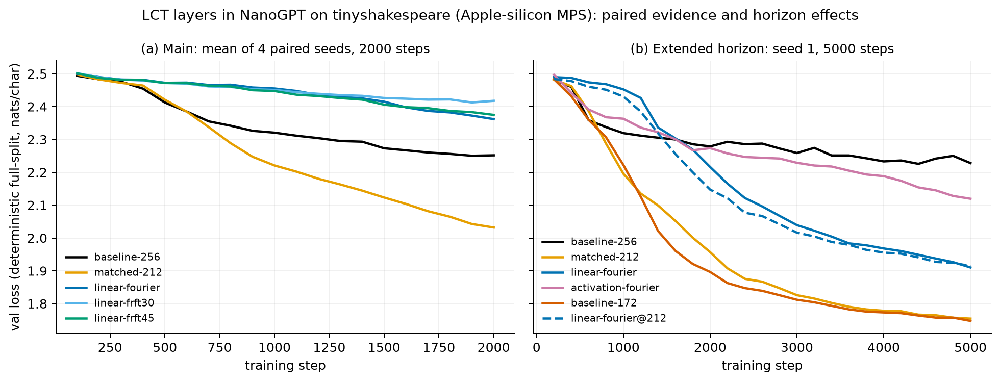
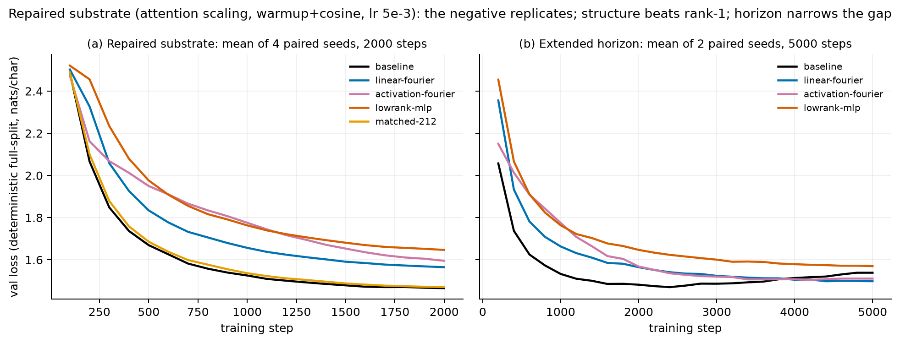

# Trainable Linear Canonical Transform Layers: Implementation, Cross-Backend Parity, and an Honest Small-Scale Evaluation

**Alok Singh**
`lct-activation` — https://github.com/alok/linear_canonical_transform

## Abstract

We present `lct-activation`, an open implementation of trainable
finite-dimensional Linear Canonical Transform (LCT) layers for PyTorch and
MLX: a structured `O(N log N)` alternative to dense linear layers
(`LCTLinear`) and a nonlinear modReLU-style activation acting in the LCT
domain (`LCTActivation`). The package makes an unavoidable discretization
tradeoff explicit — a finite LCT cannot simultaneously be unitary, compose
like its underlying symplectic parameters, and sample the continuum kernel —
and exposes both normalization choices. We contribute (i) a fast
implementation whose structured linear layer overtakes dense matmuls at
1024–2048 features on Apple-silicon GPUs (5.1x at 4096 on MPS); (ii) a
bit-sharing methodology for cross-backend numerical parity, motivated by a
rank-deficiency amplification effect that turns 1-ulp construction
differences into O(1) output divergence; and (iii) a pre-registered,
adversarially reviewed evaluation on character-level language modeling that
*overturns our own earlier positive results*. Under paired seeds, parameter-
matched controls, and deterministic evaluation, the LCT layers are not an
improvement: they lose to a parameter-matched narrower dense baseline in 4/4
paired seeds, a verdict that replicates across two substrates (including one
with standard attention scaling and a tuned warmup+cosine schedule), two
datasets (tinyshakespeare, text8), two hardware targets (Apple MPS, A100),
and a 15x parameter range. Two positives survive the same controls: at
exactly matched parameter budgets the LCT layer consistently beats a rank-1
factorized control (by 0.083 nats at 2.2M parameters; catastrophically at
34M), and it is consistently faster than the same-width dense model at trunk
width 1024+ — kernel-level microbenchmark wins reach 18x on square shapes at
width 8192. The evaluation surfaced five harness bugs — including an
input-gradient error in the reference implementation and an activation whose
parameters never trained. We argue the negative result and the methodology
are the publishable substance: small-scale architecture evidence is
extraordinarily easy to get wrong, and we document exactly how.

## 1. Introduction

The Linear Canonical Transform generalizes the Fourier, fractional Fourier
(FrFT), Fresnel, and scaling transforms into a single three-parameter family
indexed by a unit-determinant 2x2 matrix acting on time–frequency space. As a
neural network primitive it is attractive for two reasons: a *structural*
prior (mixing in a learned time–frequency rotation rather than an arbitrary
dense map) and a *computational* one (`O(N log N)` FFT-based evaluation
versus `O(N^2)` matmul). Since `ad - bc = 1`, a learnable LCT layer needs
only three transform parameters plus whatever pointwise structure is placed
in the transform domain.

This report documents the complete arc of building and honestly evaluating
such layers:

1. **Layers and tradeoffs** (§2–3): the finite-dimensional LCT cannot keep
   all its continuum properties; we expose the unitary/compositional choice
   as a layer argument and provide diagnostics that measure both errors.
2. **Fast implementation** (§4): a five-path dispatch (identity/resample,
   FFT, chirp–FFT–chirp, Bluestein chirp-z, dense) in PyTorch, and an MLX
   backend that compiles fixed transform parameters into precomputed
   per-length plans.
3. **Cross-backend parity as a correctness instrument** (§5): the two
   backends agree to ~1e-6 on every path because dense kernels and chirp
   tables are shared bit-for-bit; naive "equally accurate" reimplementation
   provably diverges O(1) through a rank-deficient QR.
4. **Microbenchmarks** (§6): on Apple silicon, `LCTLinear` overtakes dense
   `nn.Linear` at 1024–2048 features; the MLX backend is the fastest path for
   the activation at transformer-typical widths.
5. **A pre-registered NanoGPT evaluation with replications** (§7): paired
   seeds, parameter-matched dense and rank-1 controls, deterministic
   evaluation, and a decision rule fixed before the confirmatory runs — then
   replicated on a repaired substrate, a second dataset, and A100 hardware at
   15x the parameters. The headline is negative and stable; the section
   documents the five harness bugs that had previously produced spurious
   positives.

We believe the most broadly useful contributions are §5 and §7: a worked
example of making two numerical backends agree for the right reasons, and a
worked example of how architecture evaluations mislead at small scale.

## 2. Background: the finite-dimensional LCT and its forced tradeoff

The continuum LCT with parameters `(a, b, c, d)`, `ad − bc = 1`, acts on
`f ∈ L²(R)` as an integral transform with chirp-modulated Fourier kernel; for
`b ≠ 0`:

```
(L_M f)(u) = A_b ∫ exp(iπ (a t² − 2 t u + d u²)/b) f(t) dt
```

Special cases: `(0, 1, 0)` Fourier; `(cos θ, sin θ, −sin θ)` FrFT of angle θ;
`(1, λz, 0)` Fresnel propagation; `b = 0` reduces to a scaled, chirp-
multiplied identity. The family composes by matrix multiplication of the
parameters and each member is unitary.

On a length-`N` grid, no discretization retains all three properties
(unitarity, parameter composition, kernel sampling) simultaneously. The
package therefore exposes:

- `normalization="unitary"`: energy-preserving scaling, optionally with a QR
  projection of the sampled dense kernel onto the unitary manifold. Favors
  stable optimization; composition error is nonzero.
- `normalization="compositional"`: the continuum amplitude `1/sqrt(ibN)`,
  which tracks parameter composition more closely at the cost of exact
  energy preservation.

A separate spectral-FrFT construction (fractional powers of the DFT via its
four spectral projectors) is unitary *and* compositional up to float error,
but is a finite-dimensional FrFT algebra rather than a sampled continuum
kernel; it ships as a diagnostics API, deliberately not as a layer backend.
The `lct check-properties` / `sweep-properties` / `assert-properties` CLI
measures determinant, unitarity, and composition errors for any
configuration.

## 3. The layers

**`LCTLinear(in_features, out_features)`** packs real channels into complex
pairs (`z_k = x_{2k} + i·x_{2k+1}`), applies the LCT along the feature axis,
multiplies by a learnable complex diagonal, applies the inverse transform
(optional), unpacks, and crops. With the default Fourier parameters the
forward is FFT → diagonal → iFFT: a circulant-like structured map with
`padded/2 + out` real parameters instead of `in × out`. Initialization is
identity-like (unit diagonal), so it can replace an `nn.Linear` inside a
pretrained-shaped network without blowing up activations — a property that
turns out to dominate its training dynamics (§7.5). `to_linear()`
materializes the equivalent dense layer for testing and export.

**`LCTActivation` / `LCTModReLU(channels)`** packs to complex pairs,
transforms, applies modReLU (`relu(|z| + β) · z/(|z| + ε)` with per-channel
learnable bias β), optionally inverse-transforms, unpacks, and mixes with a
learnable residual. It is genuinely nonlinear (unlike `LCTLinear`) and adds
only ~`channels/2 + 2` parameters.

## 4. Implementation

### 4.1 PyTorch dispatch

`linear_canonical_transform` selects among five numerical paths per call,
in order: (1) `|b| ≤ ε`: chirp-multiplied resampling implemented with
`grid_sample`, with an exact-identity fast path; (2) `a≈0, b≈±1, c≈0`:
plain FFT/iFFT; (3) a Laplace-like `(0, i, i)` dense special case; (4)
`|b| = 1`: chirp → FFT → chirp; (5) otherwise dense `N×N` kernel for
`N ≤ dense_threshold`, else Bluestein chirp-z (one FFT convolution of
padded length `2^⌈log2(2N−1)⌉`, valid for any `b`). Dispatch happens
eagerly per forward because the transform parameters are, in principle,
learnable tensors.

### 4.2 MLX backend

MLX traces computation lazily, so per-forward branch selection on parameter
*values* is impossible. The MLX backend (`lct_activation.mlx`) therefore
fixes `(a, b, c)` at construction and compiles a *plan* per feature length:
chirps, Bluestein tables (including the FFT of the convolution kernel), and
dense kernels become precomputed constants; the runtime forward is purely
FFTs, complex elementwise multiplies, and matmuls. This is both a
correctness necessity and a speed win — the torch implementation pays
per-call dispatch overhead (several scalar GPU→CPU syncs per forward on
MPS; a review probe that swapped the transform for a numerically identical
direct FFT recovered 37–48% of the activation's forward time at dim
1024–4096) that the MLX plans eliminate. The learnable parts (modReLU bias/gain/
residual mix; spectral diagonal and bias) remain ordinary trainable
parameters under `mlx.nn.value_and_grad`. Metal-specific gaps required two
workarounds: complex64 `eye` construction routes through NumPy, and the
`b≈0` gather runs on separate real/imag planes because complex64 scatter
(the vjp of gather) does not exist on Metal.

## 5. Cross-backend parity as a correctness instrument

We required the two backends to agree numerically on the same inputs, and
this requirement — enforced by 36 parity and gradient tests covering every
dispatch path — repeatedly found real bugs. Three findings generalize
beyond this codebase:

**Rank-deficiency amplifies ulps to O(1).** The centered dense LCT kernel is
numerically rank-deficient at moderate sizes (condition number ~1e9 at
N = 64). Its unitary QR projection therefore amplifies even 1-ulp kernel
construction differences (`np.exp` vs `torch.exp` last-bit disagreement)
into completely different — individually unitary — Q factors: 8 of 15 FrFT
angles diverged beyond 1e-3 (worst maxabs 3.3) while the test suite passed
at one lucky angle. Reimplementing "the same formula, equally accurately" is
insufficient; the MLX plan takes the kernel *verbatim* from the torch
reference by applying it to an identity matrix at compile time. The same
argument forces the layer's `d = (1+bc)/a` to be computed in torch's float32
arithmetic: a 1e-7 difference in `d` alone reproduced O(1) layer divergence.

**Precision improvements are parity bugs.** torch builds chirp tables in
float32; at Bluestein-scale phases (`π n²`, ~1e5–1e6 rad) that rounding is
the dominant numerical effect. An earlier draft built MLX tables in float64
— ~1000x closer to the float64 ground truth — and silently diverged from
the reference by 17% of peak output at N = 2048. For a port, matching the
reference's rounding beats improving on it; accuracy upgrades belong in
*both* backends or neither.

**A second implementation is a gradient oracle.** Comparing input gradients
across backends (with finite differences as referee) exposed a pre-existing
bug in the torch reference: the tile-expansion backward used the adjoint of
`repeat_interleave` where the forward uses `repeat`, so `LCTLinear` computed
wrong input gradients whenever `out_features > in_features` — the exact
configuration of a transformer MLP up-projection. Losses and parameter
gradients looked normal; every training result involving expanding
`LCTLinear` layers was silently corrupted (§7.1). The regression test uses
an exact oracle available for any linear layer:
`∂/∂x Σ(layer(x)·G) = G·W` with `W` the materialized weight.

## 6. Microbenchmarks (Apple silicon)

Forward pass, batch 8 × seq 256, median of 30 steps, M-series laptop
(artifact: `paper/results/bench_mac_local.json`):

| dim  | backend   | `nn.Linear` | `LCTLinear` | GELU    | `LCTActivation` |
|------|-----------|-------------|-------------|---------|-----------------|
| 1024 | torch MPS | 0.54 ms     | 0.39 ms     | 0.29 ms | 1.49 ms         |
| 1024 | MLX       | 0.49 ms     | 0.49 ms     | 0.18 ms | 0.74 ms         |
| 4096 | torch MPS | 5.64 ms     | 1.11 ms     | 0.47 ms | 2.53 ms         |
| 4096 | MLX       | 5.40 ms     | 1.96 ms     | 0.27 ms | 2.59 ms         |

The structured layer overtakes the dense matmul at 1024–2048 features
(5.1x at 4096 on MPS) — for *square* layers. On a training GPU the
separation is far larger (A100-SXM4-40GB, batch 16,384, median of 30 steps;
artifact `paper/results/modal_a100_microbench.json`):

| shape | dim | dense fwd | LCT fwd | dense/LCT (fwd) | dense/LCT (fwd+bwd) |
|---|---|---|---|---|---|
| square | 1024 | 2.41 ms | 0.98 ms | 2.5x | 2.8x |
| square | 4096 | 29.1 ms | 3.35 ms | 8.7x | 9.1x |
| square | 8192 | 115.3 ms | 6.45 ms | 17.9x | 18.3x |
| d/4 -> d | 1024 | 0.66 ms | 0.93 ms | 0.7x | 0.8x |
| d/4 -> d | 4096 | 7.32 ms | 3.31 ms | 2.2x | 2.4x |
| d/4 -> d | 8192 | 29.0 ms | 6.42 ms | 4.5x | 4.6x | Rectangular maps change the
economics: a dense `d → 4d` up-projection costs a quarter of the square
matmul at width `4d`, while the LCT path pays the full padded-width FFT
regardless; in the NanoGPT setting below (256 → 1024), the LCT MLP runs at
0.85x dense throughput. Timings differentiate w.r.t. inputs and parameters
on both frameworks; MLX work is forced with `mx.eval` and MPS is
synchronized inside the timed region.

## 7. Does it help a real model? A pre-registered evaluation

Earlier evidence in this project — 20–40-step runs at dim 64 on CPU/MPS —
showed LCT variants beating a NanoGPT baseline by 0.03–0.13 nats and
motivated the "promising layer" framing. Those results do not survive fair
evaluation. We describe the failure modes first because they are the
transferable lesson.

### 7.1 Five ways the evidence was wrong

1. **Wrong input gradients** in every configuration with an expanding
   `LCTLinear` (§5), i.e. every `linear-*`/`hybrid-*` NanoGPT run: gradients
   upstream of each MLP up-projection were corrupted. (Re-running the two
   affected CPU sweeps seed-identically after the fix *improved* the linear
   variants in 8/9 rows — this bug was anti-LCT, masking ~0.03 nats.)
2. **The activation never trained.** The lazy activation wrapper
   materializes its parameters on first forward; the harness built the
   optimizer before any forward ran, so every recorded `activation-*` run
   optimized a frozen activation. (Separately, the activation factory
   crashed on newer kwargs — the presets were unrunnable at head.)
3. **Every seed was the same seed.** The harness exec's the NanoGPT module
   source, which calls `torch.manual_seed(1337)` at import time — *after*
   the harness set its per-trial seed. All "different seeds" were bit-
   identical runs; seed-consistency claims would have passed vacuously.
4. **Unpaired comparisons.** Batches were drawn from the global RNG, which
   each variant's differently-shaped initialization consumes differently, so
   variants saw different data orders even at the same seed. Batches now
   come from a dedicated generator: all configs at a seed see identical
   sequences, enabling paired per-seed deltas.
5. **Noisy evaluation.** Validation was 8 random batches; the val split is
   only ~435 non-overlapping windows, so we replaced sampling with a
   deterministic full-split sweep (same cost, zero eval variance). Measured
   cross-invocation MPS noise is ~0.03 nats — the size of the previously
   reported effects.

An adversarial red-team review of the protocol (three critics, each finding
independently verified or refuted by separate agents against the code)
found items 3–5 plus the capacity confound below; items 1–2 were found by
the cross-backend parity work.

### 7.2 Protocol

Char-level tinyshakespeare (1.1 MB, vocab 65, contiguous 90/10 split);
local NanoGPT variant (pre-LN, ReLU MLP, learned positional embeddings, and
— a substrate quirk shared by all arms — no attention `1/√d` scaling);
4 layers, 4 heads, dim 256, seq 256, batch 64, dropout 0.2, AdamW at
constant lr, weight decay 0; Apple-silicon MPS. Variants: `linear-*`
replaces each MLP up-projection with `LCTLinear` (−32% total parameters);
`activation-*` replaces the MLP ReLU; `hybrid` both. Controls: the dim-256
baseline *and a parameter-matched dim-212 baseline* (2.25M vs 2.21M params;
at ~30 epochs a 32% capacity cut alone delays overfitting, so same-
architecture comparisons at the final step are confounded). Pilots (300
steps) selected lr = 1e-3 for every family and `fourier + unitary +
no-inverse` as the best LCT cell; pilots were selection-only by rule. The
confirmatory run used 4 common seeds with paired batch streams, 2,000
steps, deterministic full-val every 100 steps, and this decision rule fixed
in advance: a variant is a *real improvement* iff its paired best-val delta
against the matched baseline is below −0.01 nats with a consistent sign in
4/4 seeds, and it does not lose more wall-clock than it gains.

### 7.3 Confirmatory result: negative



| config | params | tok/s | best-val (mean of 4 paired seeds) |
|---|---|---|---|
| baseline dim-256 | 3.26M | 171k | 2.2496 |
| **matched baseline dim-212** | 2.25M | **197k** | **2.0313** |
| linear-fourier | 2.21M | 145k | 2.3619 |
| linear-frft30 | 2.21M | 102k | 2.4124 |
| linear-frft45 | 2.21M | 102k | 2.3729 |

Every LCT configuration regresses against both controls in 4/4 paired seeds
(vs matched-212: +0.33 to +0.38 nats; vs dim-256: +0.11 to +0.16), at
0.60–0.85x baseline throughput. Two methodological observations from the
same data: the 300-step pilot's angle ranking (frft45 > frft30 > fourier)
*inverted* by 2,000 steps — short-horizon model selection actively misleads
— and per-seed spread (sd up to 0.11 nats) confirms that the historical
single-realization deltas were within noise.

### 7.4 The controls disagreeing is itself a finding

The matched dim-212 baseline beats the dim-256 baseline by 0.22 nats — the
*smaller* dense model wins, consistent with the substrate's missing
attention scaling degrading wider heads at this constant lr. Fair
comparisons survive this (all arms share the substrate), but it shows the
baseline-256 is a sick control: beating it is necessary, not sufficient.

### 7.5 Horizon effects: the identity-initialized layer takes off late

A single-seed exploratory run at 5,000 steps reverses the same-architecture
comparison: `linear-fourier` starts slowly (identity initialization keeps
the MLP near a tiled pass-through), crosses the dim-256 baseline near step
2,000, and finishes at **1.910 vs 2.228** — while the dense baseline
plateaus (best 2.226 at step 4,400). The repaired activation variant also
passes the baseline (2.119). Neither approaches the dense controls: at the
healthy width the pattern repeats one level down, with `linear-fourier@212`
reaching 1.914 against `baseline@212` at 1.740 and its own parameter-matched
control `baseline@172` at 1.747 — the latter at 1.8x the throughput.
Strikingly, the LCT-MLP model lands at ~1.91 at *both* trunk widths: the
structured up-projection, not the trunk, is the capacity bottleneck in this
regime.

### 7.6 Replication on a repaired substrate

Both external-validity threats were then removed: standard
`1/sqrt(head_dim)` attention scaling (patched identically into all arms) and
100-step warmup with cosine decay, with the peak lr re-selected by a fresh
pilot sweep {1e-3 ... 1e-2} plus a 2,000-step tiebreak (5e-3 won; the
repaired dim-256 baseline reaches val 1.4714, char-quality on par with
canonical NanoGPT results, from a 3.3M-parameter model). A new control was
pre-registered: **rank-1 factorized up-projections** (`lowrank-mlp`) at
2,214,977 parameters — within 0.05% of `linear-fourier` — answering "what
else could the identical parameter budget buy". 4 paired seeds, 2,000 steps
(artifacts `std_main_*`):

| config | params | tok/s | best-val (mean ± sd, 4 paired seeds) |
|---|---|---|---|
| baseline dim-256 | 3.26M | 171k | **1.4656 ± 0.0103** |
| matched baseline dim-212 | 2.25M | 194k | **1.4702 ± 0.0050** |
| linear-fourier | 2.21M | 145k | 1.5645 ± 0.0060 |
| activation-fourier | 3.26M | 112k | 1.5954 ± 0.0080 |
| lowrank-mlp (rank 1) | 2.21M | 186k | 1.6470 ± 0.0065 |

Three things resolve at once. (i) The dense controls now agree (paired
deltas of the two baselines overlap zero), confirming the earlier width
anomaly was the missing attention scaling — the substrate is healthy.
(ii) **The negative verdict replicates**: `linear-fourier` loses to both
dense controls in 4/4 paired seeds (+0.094/+0.099 nats), and the
activation's earlier long-horizon "win" disappears (+0.130 vs baseline,
4/4) — it was an artifact of the sick control. (iii) A genuine positive
emerges: at an exactly matched parameter budget, `linear-fourier` beats the
rank-1 control in 4/4 seeds (−0.083 ± 0.007), as does the activation
(−0.052 ± 0.009). **LCT structure out-buys naive factorization; neither
out-buys a narrower dense model.**



Two replications extend this. *Horizon* (2 paired seeds, 5,000 steps, same
substrate): the late-takeoff dynamic survives the schedule — the baseline
reaches its best by step ~2,400 and plateaus while the LCT arms keep
improving, narrowing `linear-fourier`'s gap from +0.094 at 2,000 steps to
+0.019/+0.033 nats at 5,000. The gap shrinks with horizon but, on a healthy
substrate, no longer closes. *Dataset* (10 MB text8 slice, dim 256, 2 paired
seeds): the ordering replicates with larger margins (`linear-fourier`
+0.14/+0.17 vs baseline; rank-1 and the activation further behind at
+0.29–0.33).

### 7.7 Scale and dataset replication (A100, text8, trunk width 1024)

The remaining live hypothesis was wall-clock: past the microbenchmark
crossover, a quality-neutral LCT layer would win on time. We tested it at
trunk width 1024 (MLP up-projection 1024 -> 4096, where the A100
microbenchmark gives LCT a 2.2–2.4x kernel advantage) on a 10 MB text8
slice, standard substrate, 3,000 steps, 2 paired seeds, with a dim-840
dense baseline parameter-matched to the linear variant within 0.8%
(artifacts `modal_train_*`):

| config | params | tok/s | best-val (2 seeds) |
|---|---|---|---|
| **matched baseline dim-840** | 34.2M | **64.5k** | **1.2956 / 1.2938** |
| baseline dim-1024 | 50.7M | 48.4k | 1.3430 / 1.3271 |
| linear-fourier @1024 | 33.9M | 60.1k | 1.4087 / 1.4107 |
| lowrank-mlp @1024 (rank 1) | 33.9M | 64.8k | 2.0406 / 1.8816 |

The pattern is unchanged at 15x the parameters on a different dataset and
hardware: the LCT variant beats the same-width dense model on throughput
(1.24x) and crushes the rank-1 control (which collapses entirely at this
scale), but the parameter-matched narrower dense model dominates
everything — better loss than every arm *and* faster than the LCT model.
Kernel-level wins on the up-projection do not convert to end-to-end wins,
because narrowing the trunk buys more quality per parameter and more speed
than restructuring one projection. The microbenchmark's square-shape
dominance (18x at 8192) identifies where a conversion could still happen:
attention projections at width >= 2048, which no experiment here tested.

### 7.8 Verdict

Across two substrates, two datasets, two hardware targets, and a 15x
parameter range, under fair controls: **the LCT layers are not an
improvement over dense baselines, and none of the swept tuning axes (lr ×
angle × normalization × inverse × schedule) makes them one.** The
reproducible positives are narrower but real: at exactly matched parameter
budgets the LCT structure consistently beats rank-1 factorization (4/4
seeds on shakespeare; catastrophically so on text8 at 34M parameters), and
the LCT variant is consistently faster than the *same-width* dense model at
trunk width 1024+. The honest positives are narrower: (i) the late-takeoff
dynamics are real and large (+0.32 nats over the same-width dense model at
5,000 steps) — the LCT up-projection rescued a pathologically plateaued
dense model, acting as a conditioning fix; (ii) the repaired activation
variant beats the same-width baseline long-horizon at equal parameter count.
Both wins are against a control that a narrower dense model beats more
simply.

## 8. Related work

Fractional Fourier and LCT theory and fast discrete algorithms are classical
(Ozaktas, Zalevsky & Kutay, *The Fractional Fourier Transform*, 2001;
Bluestein's chirp-z, 1970; Pei & Ding's discrete LCT constructions; Candan,
Kutay & Ozaktas' discrete FrFT via DFT eigenvectors — our spectral-FrFT
diagnostic). Fixed-Fourier token mixing (FNet, Lee-Thorp et al., 2021) and
Fourier Neural Operators (Li et al., 2020) established spectral mixing as a
layer; learnable-angle FrFT layers have been explored for vision and signal
tasks. Structured efficient linear layers — ACDC (Moczulski et al., 2016),
butterfly matrices (Dao et al., 2019), Monarch (Dao et al., 2022) — frame
the same params/compute-vs-quality tradeoff we measure; our negative result
is consistent with their finding that structure buys efficiency, not free
quality. modReLU is from unitary-RNN work (Arjovsky, Shah & Bengio, 2016).
Our methodological stance follows the pre-registration and paired-comparison
practices standard elsewhere in empirical ML critique (e.g., Lucic et al.,
2018, "Are GANs Created Equal?"; Melis et al., 2018, on LM evaluation).

## 9. Limitations

Character-level language modeling only, and small scale by modern
standards (2M–50M parameters); the negative result is about this regime,
not the architecture class at frontier scale. The original-substrate
extended-horizon runs are single-seed (effects ~10x the measured noise
floor, but unreplicated); the A100 study used 2 paired seeds. The
wall-clock hypothesis was tested only at the MLP up-projection placement;
the microbenchmark's square-shape dominance (18x at width 8192) leaves
attention-projection placement at width >= 2048 as the strongest untested
configuration, along with per-group lr for the ~2k spectral parameters and
domains whose signals are chirp-like (audio, radar), where the LCT prior
has its physical motivation. The MLX backend fixes transform parameters at
construction; learnable-(a,b,c) training is torch-only.

## 10. Reproducibility

Everything below runs on a stock Apple-silicon Mac from the repository root.

```bash
uv sync --extra dev            # pulls mlx automatically on darwin/arm64
uv run pytest -q               # 149 tests: parity, gradients, harness seeds
uv run python scripts/bench_mac_local.py   # microbenchmark table
uv run lct-tune-nanogpt --device mps ...   # any experiment arm; see protocol
uv run python scripts/analyze_mps_main.py  # decision-rule table from artifacts
MPLBACKEND=Agg uv run --with matplotlib python scripts/plot_mps_study.py
```

Protocol: `paper/experiments/mps_shakespeare_protocol.md` (decision rule
pre-registered; outcome and Amendment A appended). Artifacts:
`paper/results/mps_*.json` (original substrate: pilots, 4-seed main,
extended horizon, healthy-width controls), `std_*.json` (repaired
substrate), `text8_main_*.json` (second dataset), `modal_a100_*.json` and
`modal_train_*.json` (A100 microbenchmark and text8 width-1024 study; see
`scripts/modal_width_experiment.py`), `bench_mac_local.json`. Narrative
log: `paper/nanogpt_lct_note.md`. Key commits: `5e63c6f` (gradient adjoint
fix), `48b9046` (frozen activation), `803ad1d` (seeds/pairing/deterministic
eval), `e34bfdc` (parity hardening), `25f68a3` (substrate options, low-rank
control, custom datasets). MPS cross-invocation noise floor: ~0.03 nats
(measured).
